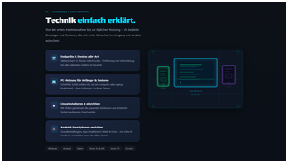
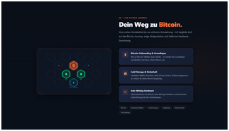
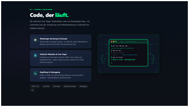
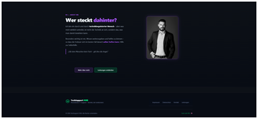

# TechSupport HUB

Persönliche IT-Support-Website – verständlich erklärt, persönlich begleitet, auf den Punkt gebracht.  
Hilfe bei Alltagstechnik, Bitcoin-Einstieg, Coding & Bugfixing – alles auf einer Seite.

## Screenshot

<table>
  <tr>
    <td></td>
    <td></td>
    <td></td>
  </tr>
  <tr>
    <td></td>
    <td></td>
    <td></td>
  </tr>
</table>

## Features

- **Dark / Light Mode** – systemweiter Theme-Toggle, Präferenz wird gespeichert
- **Responsive Design** – optimiert für Handy, Tablet und Desktop
- **User Support** – Hilfe bei Endgeräten aller Art, PC-Einrichtung, Linux, Android
- **Bitcoin Journey** – Onboarding, Cold Storage, Solo-Mining Hardware
- **Coding & Bugfixing** – Webdesign-Beratung, One-Pager, Debugging & Fehleranalyse
- **Kontaktformular** – Modal-Overlay mit direktem Mailto-Link
- **Smooth Scroll Navigation** – Logo-Toggle scrollt zum Footer und zurück nach oben
- **Unterseiten** – Ausführliche Detailseiten für Bitcoin, Coding und About

## Demo

[techsupporthub.github.io](https://kaaas58.github.io/TSH/) <!-- ggf. URL anpassen -->
